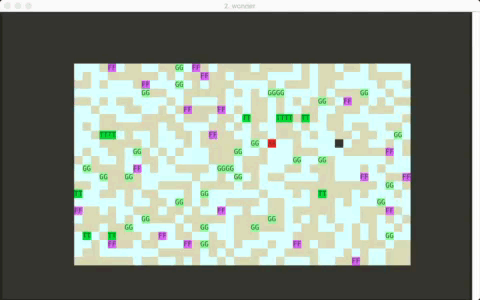

Alice wonder land. It's an attemp to build a wonder land where Alice can happily playing in.


### Install

```
$ go get -u github.com/nickelchen/wonder
```


### Usage

When Alice start running, the wonder land spread out, there are no plants or animals there.

```
$ wonder alice
```

Then you can plant some trees, flowers or grass to the land.

```
$ wonder plant --what tree --number 10
$ wonder plant --what flower --number 20
$ wonder plant --what grass --number 30
```

Let's see what the wonder land is looking now.

```
$ wonder info
```



Emm... Ugly ui, I had to admit. `GG` is grass, `TT` is tree, `FF` is flower

Red block is Alice, Black block is rabbit. you can see alice is chasing the rabbit.

The server side streams moving events(for alice), and jumping events(for rabbit)
to client, client then render them in screen. using `termbox-go`

Show me the version

```
$ wonder version
```

To be continued. It's far from finished.


### Credits

It's a go exercise project, i borrowed the project framework from [hashicorp/serf](https://github.com/hashicorp/serf),
thanks for their wonderful project and beautiful code.
